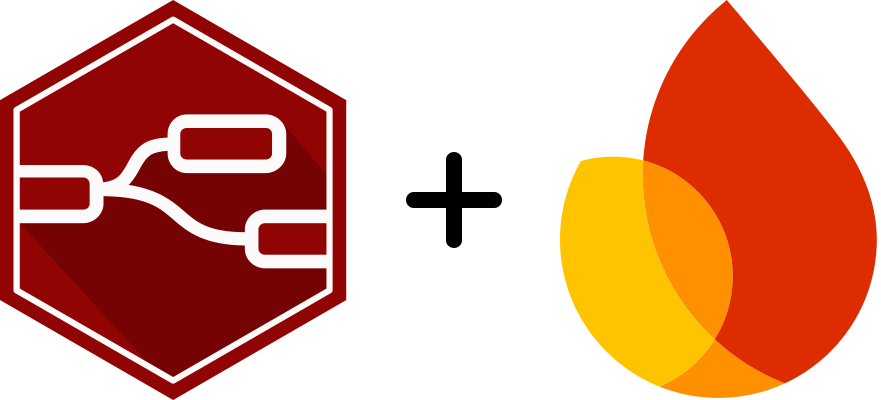
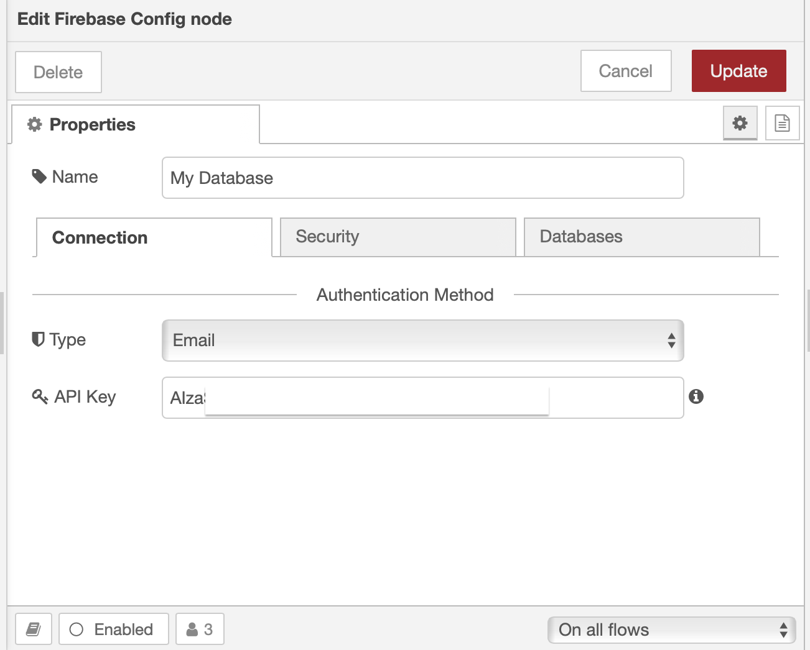
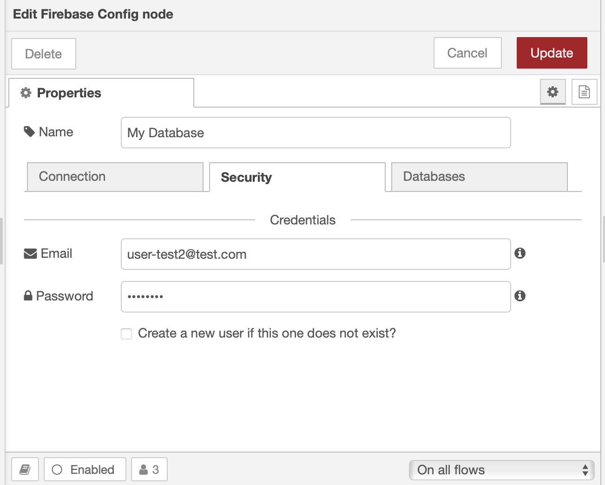
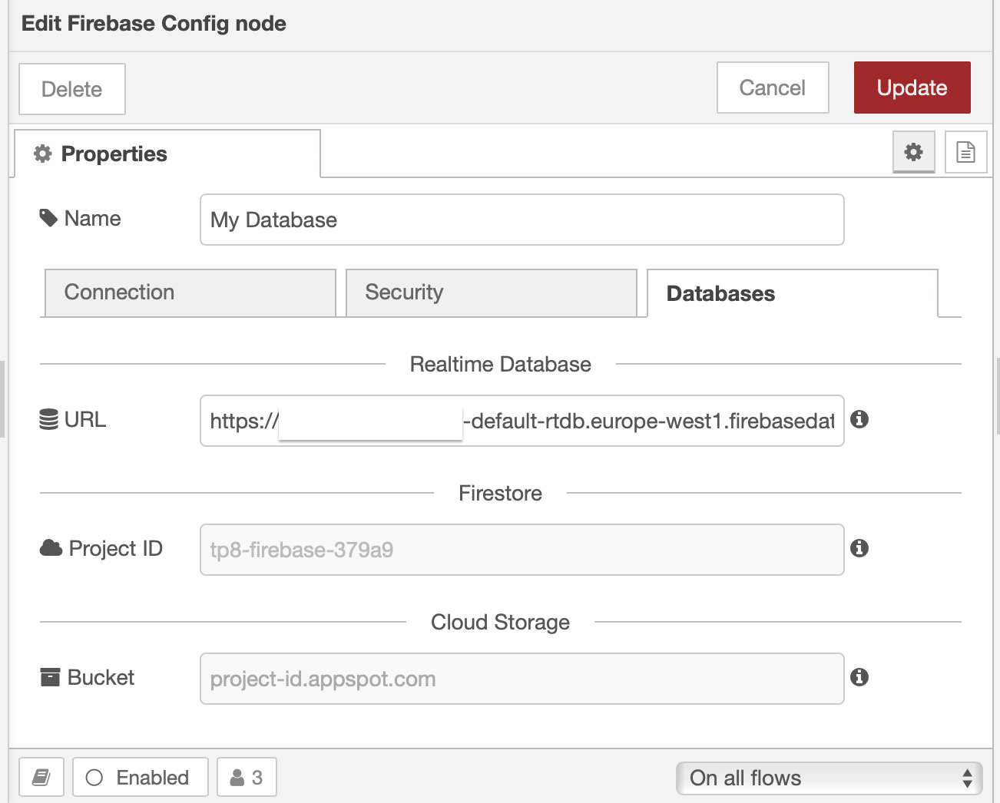

<div align="center">
  <h1>Node-RED config-node to communicate with <a href="https://firebase.google.com">Firebase</a></h1>
  <a href="https://firebase.google.com"></a>
  <p align="center">
    <br />
    <a href="https://github.com/GogoVega/Firebase-Config-Node/issues">Report Bug</a>
    ·
    <a href="https://github.com/GogoVega/Firebase-Config-Node/discussions/new?category=ideas">Request Feature</a>
    ·
    <a href="https://github.com/GogoVega/Firebase-Config-Node/discussions/new">Discussion</a>
  </p>
</div>

<div align="center">
  <a href="https://github.com/GogoVega/Firebase-Config-Node/blob/master/LICENSE"></a>
  <a href="https://github.com/GogoVega/Firebase-Config-Node/issues"></a>
  <a href="https://github.com/GogoVega/Firebase-Config-Node/stargazers"></a>
  <a href="https://github.com/GogoVega/Firebase-Config-Node/network/members"></a>
  <a href="https://www.npmjs.com/package/@gogovega/firebase-config-node?activeTab=versions"></a>
  <a href="https://github.com/GogoVega/Firebase-Config-Node/network/dependencies"></a>
</div>
<br />

## What is it?

This repo is used by the following modules:

- RTDB: [@gogovega/node-red-contrib-firebase-realtime-database](https://github.com/GogoVega/node-red-contrib-firebase-realtime-database)
- Cloud Firestore: [@gogovega/node-red-contrib-cloud-firestore](https://github.com/GogoVega/node-red-contrib-cloud-firestore)
- Cloud Storage: @gogovega/node-red-contrib-cloud-storage: **Not yet developed**

Of coure, you can use it for your own module.

## Preview

Below is a current overview of the config node, its appearance may change in the future.

<details>
<summary>Screenshot of the Connection tab</summary>

<div align="left">
  
</div>

</details>

<details>
<summary>Screenshot of the Security tab</summary>

<div align="left">
  
</div>

</details>

<details>
<summary>Screenshot of the Databases tab</summary>

<div align="left">
  
</div>

</details>

## Authentication Methods

- `Anonymous`
- `Email`
- `Private Key` (Firebase Admin Node.js SDK)
- `Custom Token` (Generated with Private Key)

## Available Databases

- RTDB
- Firestore

## How to use?

1. Add this package as dependency

```bash
npm i @gogovega/firebase-config-node@latest --omit=dev --save
```

2. Retrieve the config-node and use the built-in methods

```js
module.exports = function (RED) {
  function MyFirebaseNode(this, config) {
    RED.nodes.createNode(this, config);

    // Get the config-node
    const configNode = RED.nodes.getNode(config.database);

    // Init the RTDB and subscribe to the communication status
    configNode.addStatusListener(this, "rtdb");

    // The RTDB reference instance
    const rtdb = configNode.rtdb.database;

    // Gets data from msg.path and yields a `payload`
    this.on("input", async (msg, send, done) => {
      try {
        const snapshot = await configNode.rtdb.get(msg.path);
        send({ payload: snapshot });
        done();
      } catch (error) {
        done(error);
      }
    });

    // Unsubscribe the communication status
    this.on("close", (done) => configNode.removeStatusListener(this, "rtdb", done));
  }

  RED.nodes.registerType("my-firebase-node", MyFirebaseNode);
};
```

## Getting Started Link

- [Firebase Site](https://firebase.google.com/): What is Firebase?
- [Firestore Nodes](https://github.com/GogoVega/node-red-contrib-cloud-firestore): You search for the Google Cloud Firestore Nodes?
- [Firebase RTDB Nodes](https://github.com/GogoVega/node-red-contrib-cloud-firestore): You search for the Firebase Realtime Databases Nodes?
- [Change Log](./CHANGELOG.md): Whats changed?

## License

MIT License

Copyright (c) 2023 Gauthier Dandele

Permission is hereby granted, free of charge, to any person obtaining a copy
of this software and associated documentation files (the "Software"), to deal
in the Software without restriction, including without limitation the rights
to use, copy, modify, merge, publish, distribute, sublicense, and/or sell
copies of the Software, and to permit persons to whom the Software is
furnished to do so, subject to the following conditions:

The above copyright notice and this permission notice shall be included in all
copies or substantial portions of the Software.

THE SOFTWARE IS PROVIDED "AS IS", WITHOUT WARRANTY OF ANY KIND, EXPRESS OR
IMPLIED, INCLUDING BUT NOT LIMITED TO THE WARRANTIES OF MERCHANTABILITY,
FITNESS FOR A PARTICULAR PURPOSE AND NONINFRINGEMENT. IN NO EVENT SHALL THE
AUTHORS OR COPYRIGHT HOLDERS BE LIABLE FOR ANY CLAIM, DAMAGES OR OTHER
LIABILITY, WHETHER IN AN ACTION OF CONTRACT, TORT OR OTHERWISE, ARISING FROM,
OUT OF OR IN CONNECTION WITH THE SOFTWARE OR THE USE OR OTHER DEALINGS IN THE
SOFTWARE.
