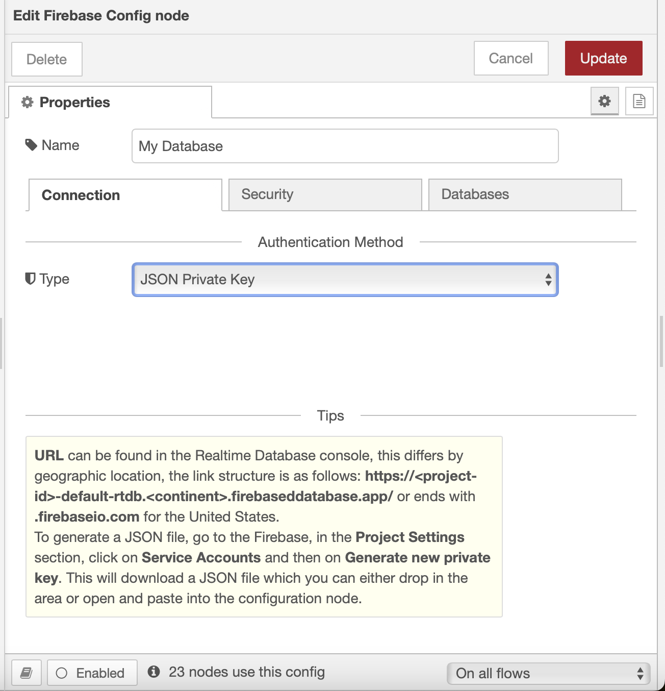

# Firebase Config Node

Node-RED config node to communicate with Google Firebase

**_WARNING_**: work in progress!!!

This repo will be the **future config node** for the following modules:

- RTDB: [@gogovega/node-red-contrib-firebase-realtime-database](https://github.com/GogoVega/node-red-contrib-firebase-realtime-database)
- Firestore: @gogovega/node-red-contrib-firestore: **Not yet developed**
- Cloud Storage: @gogovega/node-red-contrib-cloud-storage: **Not yet developed**

## Preview

Below is a current overview of the config node, its appearance may change in the future.

## License

MIT License
